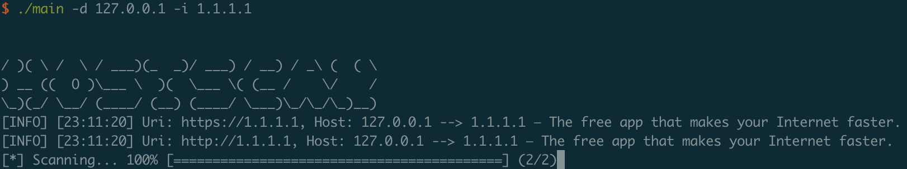

# hostscan

**自动化**Host碰撞工具，帮助红队快速扩展网络边界，获取更多目标点

## 背景

很多时候，访问目标网站时，使用其真实IP无法访问，只有域名才能访问到后端业务服务。这是因为反代服务器（如nginx）配置了禁止直接IP访问。

nginx后面的业务有时是隐藏的：
1. 不开放到外网的业务，如测试业务
2. 原来DNS解析到外网，但是后来删除了A记录（nginx后的业务没删除，转移到了内网访问）

怎么访问这些隐藏的业务呢？这就需要今天的主角登场了--Host碰撞技术

## 技术及复现详情

[Host碰撞原理及复现（含利用工具）](https://mp.weixin.qq.com/s/uH40OJ4ev0rpuzDLMn7x-A)

欢迎关注 **我不是Hacker** 公众号，不定期做一些分享


## 使用示例

```
./hostscan -d 127.0.0.1 -i 1.1.1.1
```

```
./hostscan -D input/hosts.txt -I input/ips.txt -O out/output.txt -T 5 -t 10
```

## 使用说明

请下载release中对应平台的版本运行

```
./hostscan --help
  
/ )( \ /  \ / ___)(_  _)/ ___) / __) / _\ (  ( \
) __ ((  O )\___ \  )(  \___ \( (__ /    \/    /
\_)(_/ \__/ (____/ (__) (____/ \___)\_/\_/\_)__)        
Usage of ./main:
  -D string
        Hosts in file to test
  -I string
        Nginx Ip in file to test
  -O string
        Output File (default "result.txt")
  -T int
        Thread for Http connection. (default 3)
  -d string
        Host to test
  -i string
        Nginx IP
  -t int
        Timeout for Http connection. (default 5)
  -v    Show hostscan version

```

## 运行截图



## 参考链接

[Fofapro 的 Hosts_scan](https://github.com/fofapro/Hosts_scan)
