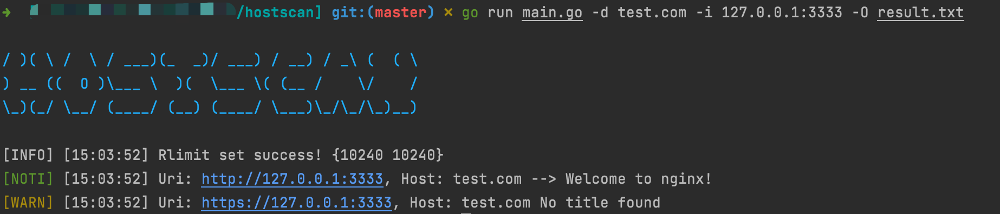
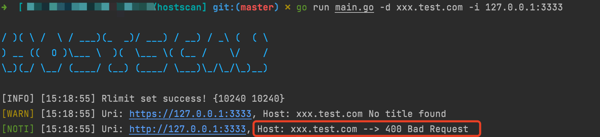

# hostscan

[English Readme](./README.md)

## 简介

**自动化**Host碰撞工具，帮助红队快速扩展网络边界，获取更多目标点

## 背景

很多时候，访问目标网站时，使用其真实IP无法访问，只有域名才能访问到后端业务服务。这是因为反代服务器（如nginx）配置了禁止直接IP访问。

nginx后面的业务有时是隐藏的：
1. 不开放到外网的业务，如测试业务
2. 原来DNS解析到外网，但是后来删除了A记录（nginx后的业务没删除，转移到了内网访问）

怎么访问这些隐藏的业务呢？这就需要今天的主角登场了--Host碰撞技术

## 技术及复现详情

[Host碰撞原理及复现（含利用工具）](https://mp.weixin.qq.com/s/uH40OJ4ev0rpuzDLMn7x-A)

## 使用示例

```
./hostscan -d test.com -i 127.0.0.1:3333
```

```
./hostscan -D input/hosts.txt -I input/ips.txt -O out/output.txt -T 5 -t 10
```

## 使用说明

请下载release中对应平台的版本运行

*注意*
- 默认并发数为3， 如果网络环境良好，请适当调大以增加速度，最高可以设置成rlimit数值
- 默认UserAgent使用的是`golang-hostscan/xxxx`，可能留存扫描痕迹，可以使用参数'-U'来使用随机UA
- 现已支持输入大文件的支持，无需担心OOM

```
hostscan --help
  
/ )( \ /  \ / ___)(_  _)/ ___) / __) / _\ (  ( \
) __ ((  O )\___ \  )(  \___ \( (__ /    \/    /
\_)(_/ \__/ (____/ (__) (____/ \___)\_/\_/\_)__)        
Usage of hostscan:
  -D string
        Hosts in file to test
  -F string
        Filter result with List of Response Status Code. 
        Example: 200,201,302
  -I string
        Nginx Ip in file to test
  -O string
        Output File (default "result.txt")
  -T int
        Thread for Http connection. (default 3)
  -U    Open to send random UserAgent to avoid bot detection.
  -V    Output All scan Info. 
        Default is false, only output the result with title.
  -d string
        Host to test
  -i string
        Nginx IP. 
        Example: 1.1.1.1 or 1.2.3.4/24
  -p string
        Port List of Nginx IP. If the flag is set, hostscan will ignore the port in origin IP input. 
        Example: 80,8080,8000-8009
  -t int
        Timeout for Http connection. (default 5)
  -v    Show hostscan version

```

## 运行截图

*使用的测试环境是下一小节中介绍的*

Host 碰撞成功



碰撞返回 400



## 测试环境

### Docker

```
docker pull vultarget/host_collision
docker run -it -p 3333:8080 --rm vultarget/host_collision
```

### Nginx 配置

#### 反代服务器 (核心)

```
server {
    listen  8080  default_server;
    server_name _;
    return 400;
}
server {
    listen  8080;
    server_name test.com;


    location / {
        proxy_pass http://127.0.0.1:80;
        proxy_redirect off;
        proxy_set_header Host $host:$server_port;
        proxy_set_header X-Real-IP $remote_addr;
            root    html;
        index   index.html  index.htm;
    }
    access_log logs/test.com.log;
}
```

第一个server表示 host为空时，会返回400

第二个server表示 nginx会根据传入的host进行服务转发，访问test.com访问的业务为 127.0.0.1:80 上的服务

#### 示例业务

```
server {
    listen       80;
    server_name  localhost;


    location / {
        root   /usr/share/nginx/html;
        index  index.html index.htm;
    }


    error_page   500 502 503 504  /50x.html;
    location = /50x.html {
        root   /usr/share/nginx/html;
    }
}
```

简单的nginx初始页面

## ChangeLog

v0.2.3
- 修复文件行数计算错误的BUG

v0.2.2
- -i选项支持IP段扫描，1.2.3.4/24
- -p选项支持自定义扫描端口，如 80,8000-8009
- -V选项输出所有扫描信息，默认关闭，只输出结果
- -F选项用于根据http响应状态码筛选结果
- 修复无参数时，进度条也会显示的bug
- 增加一些提示性输出

## 参考链接

[Fofapro 的 Hosts_scan](https://github.com/fofapro/Hosts_scan)
